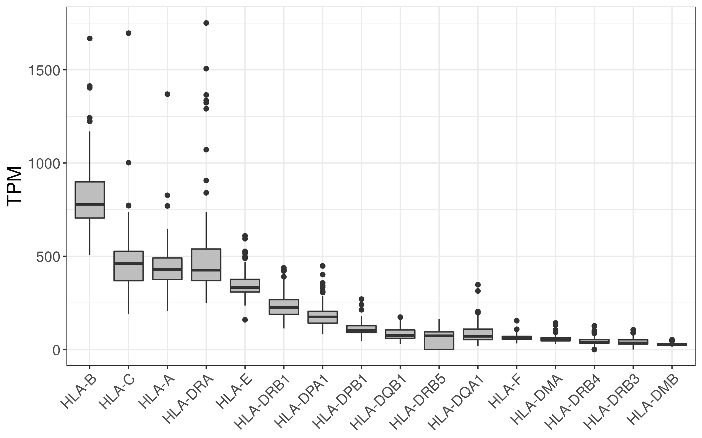
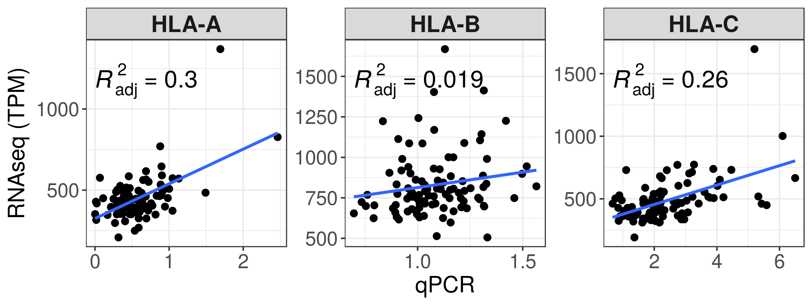
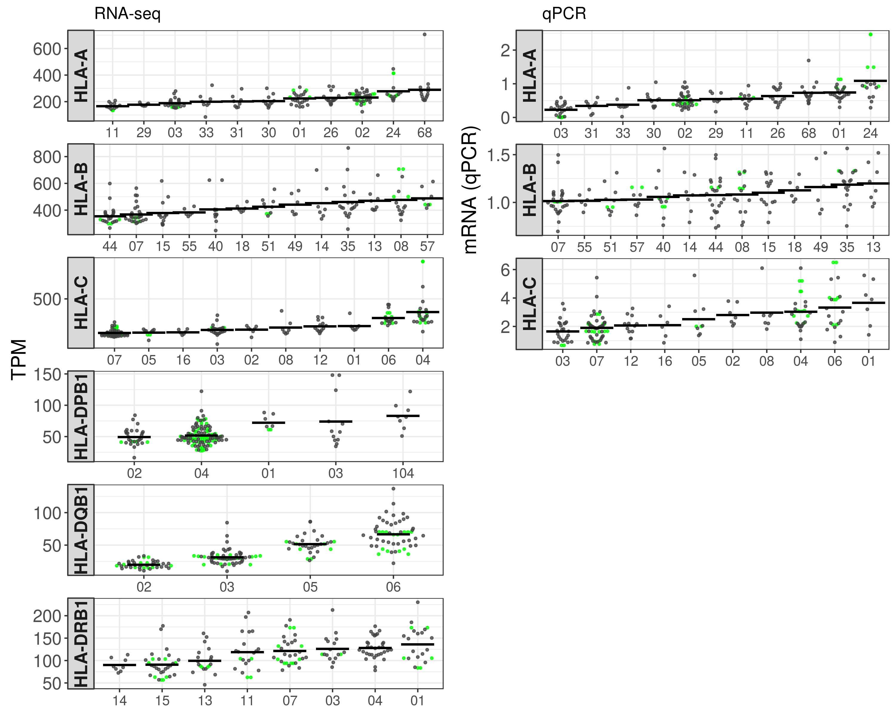
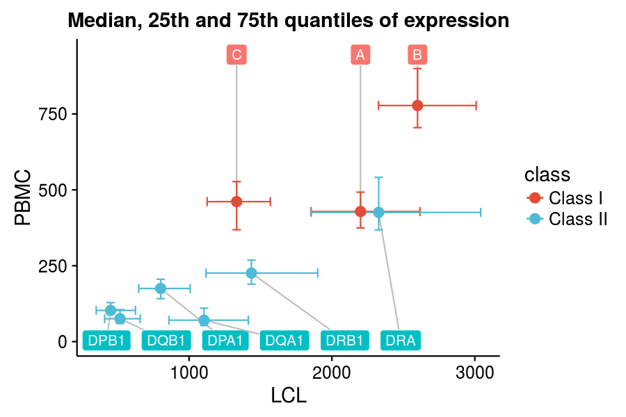
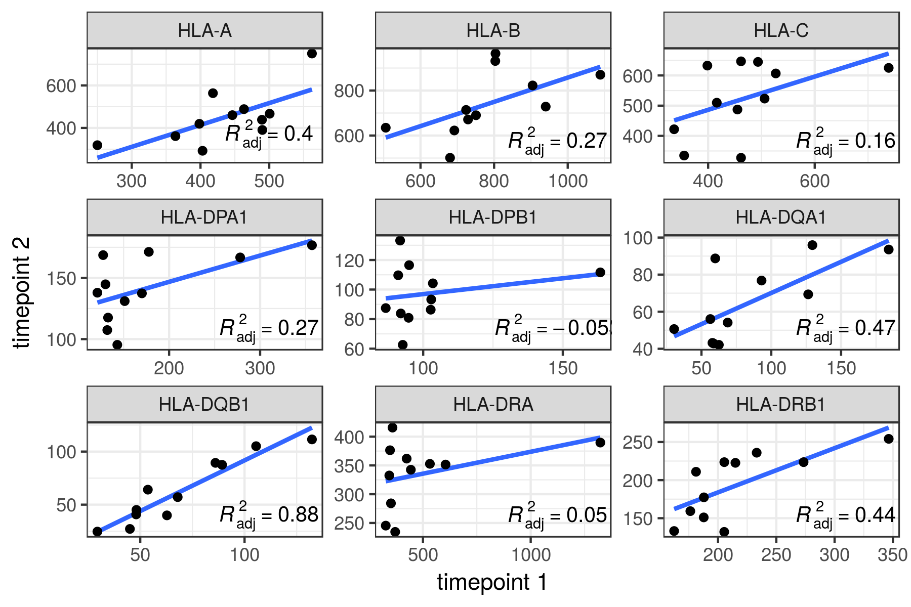
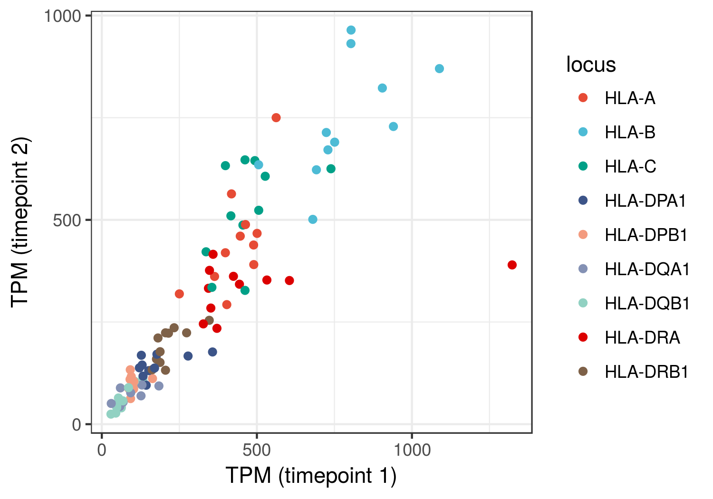

Report
================

Contrasting qPCR and RNAseq quantification of HLA class I expression
====================================================================

NCI-USP collaboration
---------------------

Document prepared by Vitor RC Aguiar and Diogo Meyer, Aug 2018
--------------------------------------------------------------

The goal of this study was to compare two technologies used to estimate HLA expression through the quantification of mRNA. We performed an RNAseq assay on a set of 96 individuals for which qPCR expression estimates were available, and for a subset of which HLA-C antibody-based HLA cell surface expression was available.

The RNAseq assay was based on our two-step strategy, where we first virtually genotype each individual (using the full list of IMGT alleles) and then perform a second mapping where we only include the two alleles the individual carries in the aligner's index. This provides allele level expression estimates, which can be converted to locus level my summing the expression of both alleles.

Typing concordance with NCI genotyping
--------------------------------------

We first quantfied our ability to correctly genotype individuals based on the RNAseq data. Our method is quite simple, and in very general terms simply involves identifying which of the alleles in the IMGT database have more NGS reads aligning to it. The table below identifies the proportion of genotypes for which our RNAseq-based genotyping matched that reported by conventional HLA typing.

\*Concordance: the proportion of the called alleles that are concordant with the NCI typing.

\*Allele calls were compared at the maximum resolution possible at each pair.

| locus |  concordance|
|:------|------------:|
| HLA-A |         0.98|
| HLA-B |         0.96|
| HLA-C |         0.97|

Expression boxplot
------------------

Here we include all HLA genes with TPM &gt; 10

Correlation between qPCR and RNAseq expression estimates
--------------------------------------------------------

We then compared the expression level estimates between RNAseq and qPCR. There is no correlation for HLA-B, some for HLA-C, and the highest is seen for HLA-A.

HLA-C expression: RNA vs Antibody
---------------------------------

Both qPCR and RNAseq strategies have low correlations with the antibody-base expression estimates, higher for qPCR.

RNAseq: expression estimates per lineage
----------------------------------------

Our approach also allows assigning expression level estimates to allelic lineages. We compare the lineage-level expression for RNAseq (first set of panels) and qPCR (second set of panels, using imputed expression by regression analysis as done in the NCI group papers).

The plots don't show the whole data, but only the overlap between the two datasets (although the totality of data was used to estimate/impute expression on both datasets).

Comparison with Geuvadis
------------------------

The order of locus-level estimates are similar for LCLs (Geuvadis) and PBMCs.

Timepoint 2
-----------

In order to evaluate whether the low correlation of RNA-seq and qPCR were due to mRNA degradation for the RNA-seq assay, we performed a second round of RNA-seq for 11 samples. Below we see the correlation between the two timepoints.

Displaying all loci on the same plot:

